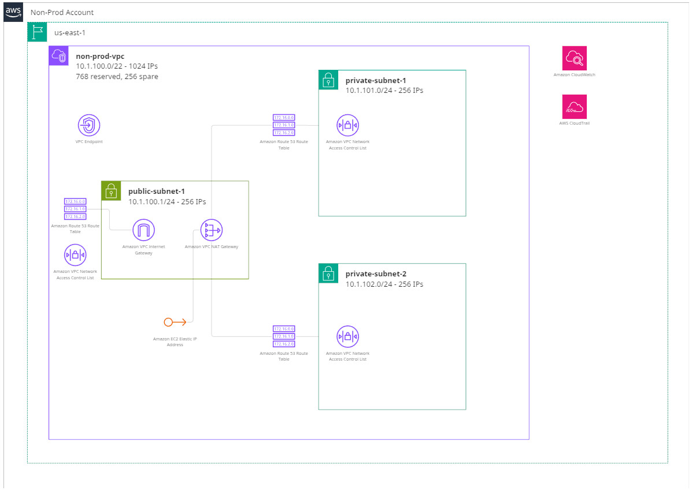

## AWS API Gateway Reference Infrastructure ##
### IaC/terraform/opentofu ###
This repository contains a reference implementation of an AWS API Gateway using Infrastructure as Code (IaC) with Terraform and OpenTofu.

### Overview ###
This project demonstrates how to set up an API Gateway and related infrastructure in AWS using Terraform/OpenTofu. It includes the necessary configurations for deploying a simple API, along with best practices for security and scalability.
### Prerequisites ###
- AWS Account: You need an active AWS account to deploy the API Gateway.
- AWS CLI: Ensure you have the AWS Command Line Interface (CLI) installed and configured with your AWS credentials. You can download it from the [AWS CLI website](https://aws.amazon.com/cli/).
- Terraform: Ensure you have Terraform installed on your local machine. You can download it from the [Terraform website](https://www.terraform.io/downloads.html).

 *Or*

- OpenTofu (preferred): Ensure you have OpenTofu installed on your local machine. You can download it from the [OpenTofu website](https://opentofu.org/download.html).

### Getting Started ###

*Our Initial Goal*

We will be creating a simple, yet functional, non-production VPC-based infrastructure. This will act as our starting point and serve as the foundation for the rest of our reference project. There are a few key points and decisions that have been made, all taking simplicity, [AWS Well-Architected Framework](https://aws.amazon.com/architecture/well-architected/) practices, and my own experiences into account:
  - As this is a non-production environent, it's kept simple until proven otherwise. It could be used as an ephemeral environment as part of a CI/CD process, or kept as a long-living environment for development, testing or sprint work.
  - The assumption is made that no direct access from the public internet is required, or **should be allowed** into the public or private subnets. In fact, the only reason there's a public subnet in this design is to house the NAT Gateway needed for the private subnets to have access to the outside world.
  - There are no public IPs assigned by default to any of the subnet resources
  - The public and private subnet Network ACLs explicitly block all traffic from the public internet (0.0.0.0/0)
  - More on the previous points later
  - It's recommended that there be at least two NAT Gateways for High-Availability and failover [CITATION], but for simplicity, this example will only use one NAT Gateway in the public subnet.
  - The addressing scheme has been kept somewhat conservative with a total available 1,024 IPs for the VPC, which should be more than enough for most situations. In this scenario, with the 3 subnets, they are divided down to /24 (256 IPs each). This allows room to grow with one or more additional subnets if needed without wasting thousands of IP addresses that would most likely never be used by assigning a /16 CIDR to the VPC itself.

*Why Is It So Locked Down? And a little background...*
Why this implementation is so locked down, it's just a non-production, ephemeral infrastructure environment.
1. **Security**: In a real-world scenario, security should always be a top priority. By limiting access to the VPC and its resources, we reduce the attack surface and potential vulnerabilities. This aligns with the principle of least privilege.
2. **Best Practices**: Following the AWS Well-Architected Framework, we aim to implement security best practices from the start. This includes restricting access to resources and ensuring that only necessary traffic is allowed in and out of the VPC.
3. **Match Production Early**: There's nothing worse than the feeling of deploying a new environment only to find out that it behaves completely differently from production due to a lack of security controls or overly permissive access. By implementing these restrictions early on, we can ensure that the development and testing environments closely match the production environment in terms of security posture and access controls.

The assumptions being made here are that there would not be any direct access to any resources living on the VPC, rather requests to a service would be coming in via API Gateway, which would be routed via VPC Link and locked down at the Network Load Balancer in front of the resource [CITATION]. Internal users and developers should also use this path of access (once deployed) by leveraging a combination of a client VPN solution, Route53 Private Hosted Zones, and an API Gateway Private API [CITATION]. This keeps the traffic within the AWS network and avoids exposing resources directly to the internet.
For public access to an API, from a JavaScript web application for example, or from external partners, a CloudFront distribution with bot detection/prevention, OWASP Top 10, and GeoFencing [CITATION] rules should be used in front of the API Gateway. Access to the API Gateway from CloudFront can then be enforced with the use of a resource policy on the API Gateway Stage [CITATION]. Most of the previous statements would apply to any sort of web site with server-side requirements.
For JavaScript-based front-ends, there's no reason to spin up a container or EC2 instance in the VPC just to serve static files. Instead, leverage Amazon S3 for static hosting and CloudFront for content delivery. This allows for a highly available, scalable, and cost-effective solution for serving static assets. Here again, leveragin Private Hosted DNS zones and VPN, non-production web sites can be kept private while still being deployed in the same manner.

*IaC Project*

The project uses a shared S3/DynamoDB backend to manage the Terraform state and locks. The [remote-state](./remote-state/README.md) directory contains the necessary configurations for setting up this backend. This sub project should be initialized and applied first to create the backend resources.
